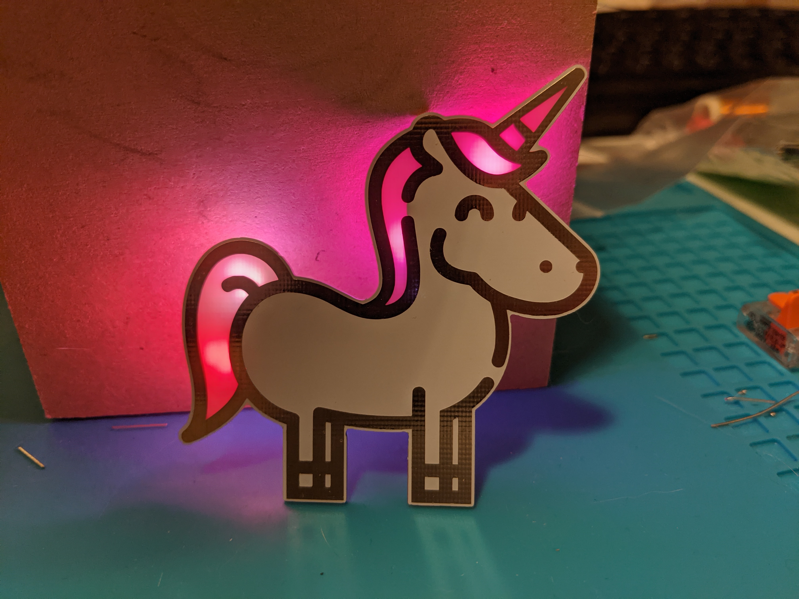
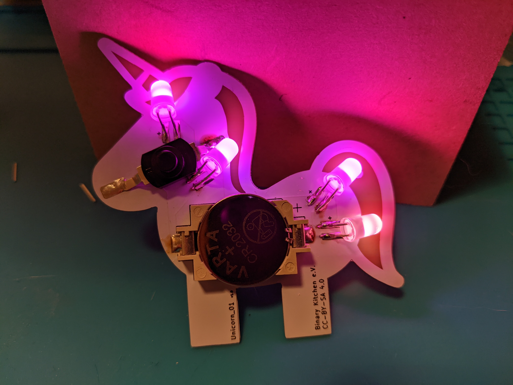

# Rainbow Unicorn

This unicorn will bright up your life. The hair is glowing in all colours of the rainbow due to RGB-LEDs on the back. The soldering kit is very simple and easy to assamble.

 

The RGB-Effect looks like this, but much better in real :)

- Status: **Complete**
- Difficulty: **2/5**

### Parts List

| Description                   | Quantity |
|-------------------------------|----------|
| RGB LEDs 5mm                  |     4    |
| Button (SMD)                  |     1    |
| CR2032 Battery Holder (SMD)   |     1    |
| CR2032 Battery (not included) |     1    |

### Manual
You can find the manual and pictures of every step here: https://github.com/Binary-Kitchen/SolderingTutorial

### Copyright and Authorship

- Board: [CC-BY-SA 4.0](https://creativecommons.org/licenses/by-sa/4.0/) - Binary Kitchen e.V. and blinkyparts.com
- Unicorn SVG [CC-BY-SA](https://creativecommons.org/licenses/by-sa/4.0/) - [Unicorn by Mooms from the Noun Project](https://thenounproject.com/term/unicorn/2061795/) (We've bought a licence, you should honor the artist work too!)
- Idea and scheme: [CC-BY-SA 4.0](https://creativecommons.org/licenses/by-sa/4.0/) - [Timo Schindler @ blinkyparts.com](https://blinkyparts.com)

### Buy Soldering Kits
If you want to buy the parts and PCB for a soldering kit you can find everything here: [shop.blinkyparts.com](https://shop.blinkyparts.com/de/Regenbogen-Einhorn-Einfacher-Bausatz-fuer-einen-tollen-Anstecker/blink232242)
